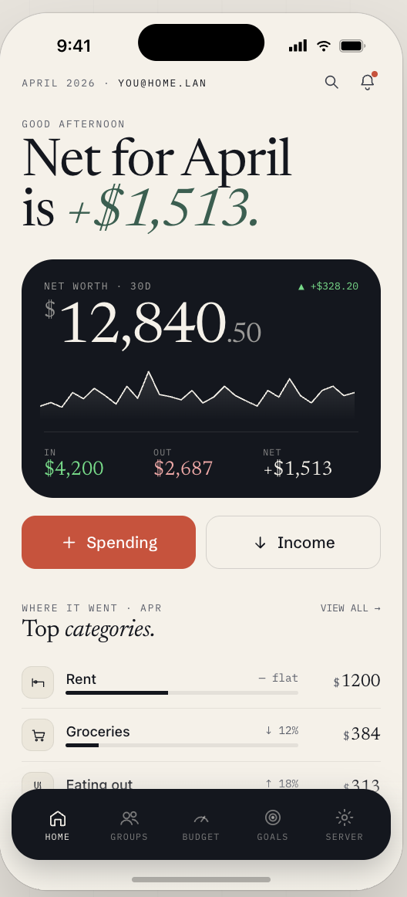
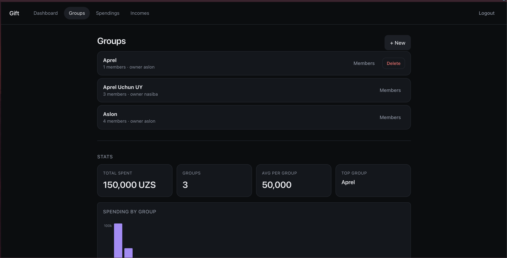

<div align="center">

# 🎁 Gift

### **Your money. Your server. Your crew.**

**A self-hosted, multi-user spendings & incomes tracker built for groups who actually split things — roommates, couples, travel crews, small teams.**

[](https://go.dev)
[](https://vuejs.org)
[](https://www.typescriptlang.org)
[](https://www.mongodb.com)
[](https://gofiber.io)
[](https://goreleaser.com)
[](https://github.com/aslon1213/gift/releases)

[🚀 Quick Start](#-quick-start) · [✨ Features](#-features) · [📦 Install](#-install) · [🛠️ Stack](#️-tech-stack) · [📚 API Docs](#-api-docs) · [🤝 Contributing](#-contributing)

</div>

---

## 🔥 Why Gift?

Ever tried to split a trip with 4 friends using a spreadsheet? **Painful.** Tried a SaaS tracker that suddenly wants $9/mo and owns your data? **Worse.**

**Gift is the middle path:** spin it up on your own box, invite your people, and start tracking. No subscriptions, no data sharing, no surprises. Cross-platform binaries for Linux, macOS and Windows — `amd64` and `arm64` — built on every tag.

> 💡 **Self-host in 5 minutes.** Invite your crew in 5 seconds. Track forever.

---

## ✨ Features

### 👥 Groups — the core primitive
Create a **group** for anything you split: *"Bali 2026"*, *"Apartment 3B"*, *"Sunday poker"*. Invite users, track shared expenses against it, see who's contributing what.

- Create / rename / delete groups
- Owner-managed membership — invite by user search, remove members anytime
- A spending can be **personal** *or* **group-scoped** — one unified API, one unified feed
- Query "groups I own" vs "groups I'm a member of" independently

### 💸 Spendings
Log expenses with the fields that actually matter.

| Field         | Notes                                    |
| ------------- | ---------------------------------------- |
| `amount`      | Decimal, any precision                   |
| `currency`    | Multi-currency ready                     |
| `category`    | Free-form, powers the donut chart        |
| `description` | Because "Starbucks $14" deserves context |
| `date`        | Time-range queries supported             |
| `group_id`    | Optional — omit for personal spending    |

Filter by **user, group, category, date range** with pagination (`limit` / `offset`) baked into the API.

### 💰 Incomes
Salary, freelance, dividends, a tip jar — log it, see it, net it against spendings.

### 🎯 Budgets, Goals, Alerts
- **Budgets** — cap spending per category / group / period
- **Goals** — "Save $3k for Bali by August" — progress-tracked
- **Alerts** — opinionated nudges when things go sideways

### 📊 Dashboard that actually tells you something
A real dashboard, not a wall of numbers.

- 🍩 **Donut chart** — spending by category at a glance
- 📈 **Bar chart** — 30-day income vs spending flow
- 💵 **Totals** — spent, earned, net balance
- 📅 Monthly rollups + time-of-day greeting because we're nice like that

### 🔐 Auth you can trust
- Email + username registration (8-char min password, bcrypt hashed)
- JWT **access + refresh** tokens — rotate without re-login
- Protected routes via Fiber middleware
- Profile editing (email, name, password), user search, logout

### 🌐 Bring-your-own-server UX
First thing the web app asks: **"Where's your server?"** Point it at `localhost`, a Tailscale IP, a domain — whatever. No hardcoded backend. One frontend build can talk to any Gift instance.

---

## 🖼️ Screenshots

> _Drop screenshots into `docs/screenshots/` and the README will pick them up._

<div align="center">

| Dashboard | Groups | Spendings |
| :-: | :-: | :-: |
|  |  |  |

</div>

---

## 🛠️ Tech Stack

<table>
<tr>
<td valign="top" width="50%">

### Backend
- **[Go 1.25.6](https://go.dev)** — statically compiled, single binary
- **[Fiber v3](https://gofiber.io)** — fast HTTP, Express-style API
- **[MongoDB v2 driver](https://www.mongodb.com/docs/drivers/go/)** — document store, flexible schema
- **[JWT (golang-jwt v5)](https://github.com/golang-jwt/jwt)** — access + refresh pair
- **[Viper](https://github.com/spf13/viper)** — `.env` + YAML config
- **[zerolog](https://github.com/rs/zerolog)** — structured logging
- **[Swaggo](https://github.com/swaggo/swag)** — OpenAPI spec generation

</td>
<td valign="top" width="50%">

### Frontend
- **[Vue 3.5](https://vuejs.org)** + **Composition API**
- **[TypeScript 5](https://www.typescriptlang.org)** — end-to-end typed
- **[Vite 8](https://vitejs.dev)** — instant dev server
- **[Vue Router 4](https://router.vuejs.org)**
- Custom **DonutChart** + **BarChart** components (no heavy chart lib)
- **Pinia-style stores** for auth + server config

</td>
</tr>
</table>

### DevOps & Tooling
- **[GoReleaser](https://goreleaser.com)** — 6-platform release automation on every tag
- **[mise](https://mise.jdx.dev)** — unified task runner + toolchain pinning
- **[air](https://github.com/air-verse/air)** — Go hot reload
- **[pre-commit](https://pre-commit.com)** — hooks for lint, format, typecheck
- **Docker** — `deployment/Dockerfile.server` + `deployment/Dockerfile.web`

---

## 🚀 Quick Start

### Prerequisites
- [**mise**](https://mise.jdx.dev/getting-started.html) (handles Go, Node, air, swag, etc. automatically)
- **MongoDB** running somewhere reachable — [local](https://www.mongodb.com/docs/manual/installation/), [Atlas](https://www.mongodb.com/atlas), or a container:
  ```sh
  docker run -d --name gift-mongo -p 27017:27017 mongo:latest
  ```

### 1. Clone & install tools
```sh
git clone https://github.com/aslon1213/gift.git
cd gift
mise install   # pulls Go 1.26, Node 25, air, swag, goreleaser, golangci-lint…
```

### 2. Configure the server
Create `server/.env`:
```dotenv
DB_URL=mongodb://localhost:27017
DB_AUTH=false
AUTH_JWT_SECRET=change-me-to-a-long-random-string
AUTH_JWT_REFRESH_SECRET=change-me-too
AUTH_JWT_EXPIRES_IN=15m
AUTH_JWT_REFRESH_EXPIRES_IN=720h
```

### 3. Run it 🏃
Open two terminals:

```sh
# Terminal 1 — API on :3000 (hot-reloading)
mise run api:dev
```
```sh
# Terminal 2 — Vue dev server on :5173 (proxies /api → :3000)
mise run web:dev
```

Open **http://localhost:5173**, point the server setup at `http://localhost:3000`, register your first user — **you're now the admin of your own finance tracker.** 🎉

---

## 📦 Install

### Grab a release binary
```sh
# Pick your platform from the releases page
curl -L -o gift-api.tar.gz \
  https://github.com/aslon1213/gift/releases/latest/download/gift-api_<VERSION>_Linux_x86_64.tar.gz
tar -xzf gift-api.tar.gz
./gift-api
```

Releases include:
- `gift-api_*` — server binary for Linux / macOS / Windows, `amd64` + `arm64`
- `gift-web_*` — static frontend bundle (serve with Nginx, Caddy, S3, anywhere)
- `docs/swagger.json` + `docs/swagger.yaml` — OpenAPI spec
- `gift_*_checksums.txt` — SHA256 sums

### Or Docker
```sh
docker build -f deployment/Dockerfile.server -t gift-api .
docker build -f deployment/Dockerfile.web    -t gift-web .
```

### Or build from source
```sh
mise run api:build     # → server/bin/api_gateway
cd client/gift-web && npm ci && npm run build   # → client/gift-web/dist
```

---

## 📚 API Docs

The server auto-generates an **OpenAPI spec** via Swaggo. Once the API is running:

- **Swagger UI:** http://localhost:3000/docs/
- **Raw spec:** `server/docs/swagger.json` · `server/docs/swagger.yaml`
- **Health check:** `GET /health`
- **API base:** `/api/v1`

### Endpoint groups

| Area       | Routes                                                       |
| ---------- | ------------------------------------------------------------ |
| Auth       | `POST /register` · `POST /login` · `POST /refresh` · `POST /logout` |
| Users      | `GET /me` · `PATCH /me` · `GET /users/search`                |
| Groups     | `GET/POST/PATCH/DELETE /groups` · `POST /groups/:id/invite` · `DELETE /groups/:id/members/:uid` |
| Spendings  | `GET/POST/PATCH/DELETE /spendings` (filters: `user_id`, `group_id`, `category`, `start_date`, `end_date`, `limit`, `offset`) |
| Incomes    | `GET/POST/PATCH/DELETE /incomes`                             |
| Budgets    | `GET/POST/PATCH/DELETE /budgets`                             |
| Goals      | `GET/POST/PATCH/DELETE /goals`                               |
| Alerts     | `GET/POST/PATCH/DELETE /alerts`                              |

All write endpoints require a valid JWT in `Authorization: Bearer <token>`.

---

## 🗂️ Project Structure

```
gift/
├── server/                   # Go + Fiber backend
│   ├── cmd/main.go           # entry point
│   ├── configs/              # Viper config loaders
│   ├── pkg/
│   │   ├── app/              # Fiber app bootstrap
│   │   ├── handlers/         # HTTP handlers per domain
│   │   ├── repository/       # MongoDB data layer
│   │   └── routes/           # route registration
│   ├── services/             # business logic (auth, etc.)
│   ├── middleware/           # JWT guard
│   ├── platform/             # DB connection
│   └── docs/                 # generated Swagger artifacts
├── client/gift-web/          # Vue 3 + Vite frontend
│   └── src/
│       ├── views/            # Dashboard, Groups, Spendings, Incomes, Auth…
│       ├── components/       # DonutChart, BarChart, forms
│       ├── stores/           # auth + server-config state
│       ├── api/              # typed API client
│       └── utils/            # chart helpers, date utils
├── deployment/               # Dockerfile.server · Dockerfile.web
├── .github/workflows/        # GitHub Actions (GoReleaser on tag)
├── .goreleaser.yaml          # 6-platform build matrix
└── mise.toml                 # dev tasks & tool versions
```

---

## 🧰 Available Tasks

```sh
mise run api          # run API with `go run .`
mise run api:dev      # run API with air hot-reload
mise run api:build    # build → server/bin/api_gateway
mise run web:dev      # start Vite dev server
mise run release      # placeholder for release flow
```

---

## 🚢 Releasing

Every git tag kicks off **`.github/workflows/goreleaser.yml`**, which:

1. Tidies the Go module
2. `npm ci && npm run build` on the frontend
3. Cross-compiles `gift-api` for 6 OS/arch combos
4. Bundles the web dist into a separate archive
5. Ships everything — plus the Swagger spec and checksums — to GitHub Releases

```sh
git tag v0.1.0
git push origin v0.1.0
# → GitHub Actions handles the rest 🪄
```

---

## 🤝 Contributing

PRs welcome — this is a vibes-coded project that's actually going somewhere.

1. Fork + branch
2. `mise install && mise run api:dev` — make sure it runs locally
3. Install pre-commit hooks: `pre-commit install`
4. Open a PR with a clear description

Found a bug? [Open an issue.](https://github.com/aslon1213/gift/issues)

---

## 📜 License

_Add a LICENSE file at the root — MIT is a reasonable default for self-hosted projects._

---

<div align="center">

**Built with ☕, Go, and a healthy suspicion of subscription finance apps.**

⭐ Star the repo if Gift saved you from a spreadsheet.

</div>
